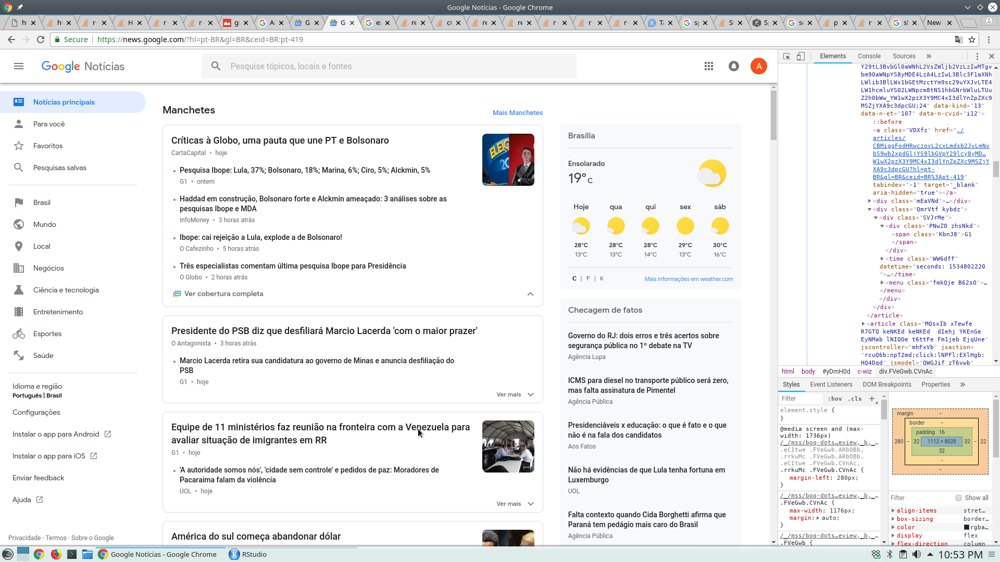

<!-- para justificar texto no markdown -->
<!-- https://stackoverflow.com/questions/43222169/how-to-justify-the-text-to-both-sides-when-knitting-html-in-rmarkdown -->
<style>
body {
text-align: justify}
</style>

---
---

```{r, echo=FALSE}
htmltools::img(src = knitr::image_uri(file.path(R.home("doc"), "html", "logo.jpg")),
               alt = 'logo',
               style = 'position:absolute; top:0; right:0; padding:1px;')
```

This is an example of how to scrappe Google News website with the awesome **rvest** package. 

This work is the result of a question in our great discussion group [**R Dojo**](https://therdojo.wordpress.com){target="_blank"}.

*AntissistemA*, a very active user in our group, came up with this problem and I decided to help him. It was a cool challenge, so why not?

I should advice you that a great deal of the basic ideas comes from his own code. I just kept on going and added few things in order the code to work.

First, you should take a look at the Google News (or Google Notícias) website [here]("https://news.google.com/?hl=pt-BR&gl=BR&ceid=BR:pt-419") which I reproduce below:



---

You may notice in the right side of the snapshot that we used the Google Chrome **dev-tools** in order to detect all the *html nodes*. You can access this tool by hitting the **F12** key. The html nodes are passed as arguments into the **rvest** functions.

Basically, the idea is to extract the communication vehicle (veiculo), the time elapsed since the news was published (tempo), and the main headline (nome).

The code are presented below: 

```{r, message=FALSE}
# loading the packages:
library(dplyr) # we want the pipes
library(rvest) # webscrapping
library(stringr) # to deal with strings and cleaning our data
```


```{r}
# extracting the whole website
google <- read_html("https://news.google.com/?hl=pt-BR&gl=BR&ceid=BR:pt-419")
```


```{r}
# extracting the com vehicles
# we pass the nodes in html_nodes and extract the text from the last one 
# we use stringr to delete strings that do not matter
veiculo_all <- google %>% html_nodes("div div div main c-wiz div div div article div div div") %>% html_text() %>%
  str_subset("[^more_vert]") %>%
  str_subset("[^share]") %>%
  str_subset("[^bookmark_border]")

veiculo_all[1:10] # take a look at the first ten

```


```{r}
# extracting the time elapsed
tempo_all <- google %>% html_nodes("div article div div time") %>% html_text()

tempo_all[1:10] # take a look at the first ten
```


```{r}
# extracting the headlines
# and using stringr for cleaning
nome_all <- google %>% html_nodes("article") %>% html_text("span") %>%
  str_split("(?<=[a-z0-9áéó!?])(?=[A-Z])") # also considering portuguese special characters

nome_all <- sapply(nome_all, function(x) x[1]) # extract only the first elements

nome_all[1:10] # take a look at the first ten
```

In this last case we used a regular expression (REGEX) to clean the data by separating the actual headline phrases from the complementary phrases. In some cases we have a phrase ending in uppercase letters such as "SP" collapsed with other phrase initiating with another uppercase letter such as "A" for example. We have to think of a better way to split these cases, but the current result is quite satisfactory for now. 

And we have our final data frame:

```{r}
df_news <- data_frame(veiculo_all, tempo_all, nome_all)

df_news
```

---

---